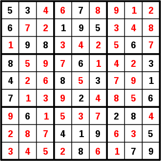
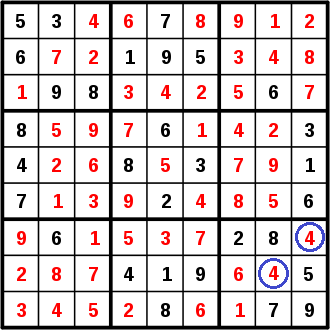

# Check-Sudoku
Little program to check if Sudoku is valid or invalid.\
There is a struct that include only the board and its size.\
According to the rules of Suduko,a valid Sudoku if those conditions are met:\
* If the board size is n, then the root of n is an integer.\
* Each number on the board is between 1 and n.\
* In each line each number will appear only once.\
* In each column each number will appear only once.\
* In each box each number will appear only once.\
\
For example, here is a valid sudoku(the numbers in black are the date, in red filled by user):\
\

and an invalid Sudoku is:\
